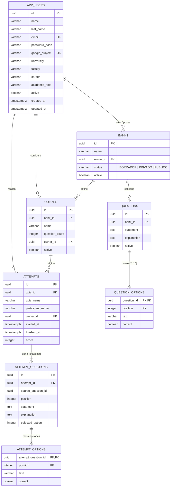

# Documentación Integral del Proyecto: API-Cuestionarios-Practica

## 1. Visión General del Proyecto

**API-Cuestionarios-Practica** es una plataforma web completa orientada a la creación, organización, práctica y corrección automática de cuestionarios y bancos de preguntas. Está diseñada específicamente para entornos académicos y formativos, integrando un catálogo oficial de universidades, facultades y carreras de Argentina (fuente SIU).

### Principales Capacidades
1. **Gestión de Bancos y Preguntas**: Creación individual manual o carga masiva transaccional mediante plantillas de Excel (`.xlsx`).
2. **Ciclo de Vida y Visibilidad**: Estados `BORRADOR` (solo autor, sin intentos), `PRIVADO` (solo autor, con intentos) y `PUBLICO` (disponible para la comunidad de usuarios registrados con perfil completo).
3. **Generación e Inmutabilidad de Intentos**: Selección aleatoria sin repetición de preguntas y creación de copias históricas (*snapshots* inmutables) que garantizan que modificaciones posteriores en el banco no alteren los intentos en curso o concluidos.
4. **Evaluación y Corrección Automática**: Ocultamiento estricto de opciones correctas y explicaciones durante la resolución; revelación de puntuaciones, porcentajes y explicaciones detalladas al finalizar.
5. **Autenticación y Perfil Académico**: Cuentas locales con validación rigurosa de contraseñas, integración opcional con Google OpenID Connect (OIDC), protección CSRF y vinculación a instituciones del catálogo académico.

---

## 2. Arquitectura del Sistema y Tecnologías

El sistema sigue una arquitectura moderna en capas, desacoplada y contenerizada:

```mermaid
graph TD
    Client["Navegador Web / Cliente HTTP"] -->|Puerto 8090 (HTTP)| Nginx["Nginx (Proxy Inverso y Archivos Estáticos)"]
    Nginx -->|/ (HTML/JS/CSS)| FrontendApp["Frontend React 19 (SPA)"]
    Nginx -->|/api/v1/* (Proxy)| BackendAPI["Backend Spring Boot 4.1 (Java 25)"]
    BackendAPI -->|JPA / Hibernate 7 / SQL| DB[(PostgreSQL 17)]
    BackendAPI -->|Lectura en inicio| CatalogFile["academic-catalog.tsv (14.7k registros)"]
    BackendAPI -.->|OIDC / OAuth2 opcional| GoogleAuth["Google Identity Platform"]
```

### Stack Tecnológico
| Capa | Tecnología | Versión / Detalle |
| :--- | :--- | :--- |
| **Lenguaje Backend** | Java | 25 LTS |
| **Framework Backend** | Spring Boot | 4.1.1 (WebMVC, Data JPA, Security, OAuth2 Client, Validation) |
| **ORM y Persistencia** | Hibernate / Jakarta Persistence | `hibernate.ddl-auto=validate`, transacciones `@Transactional` |
| **Evolución de BD** | Flyway | Migraciones versionadas (`V1` a `V4`) con soporte PostgreSQL |
| **Base de Datos** | PostgreSQL | 17 (Uso de `uuid`, `timestamptz`, índices filtrados) |
| **Pruebas Backend** | JUnit 5, AssertJ, Mockito, Testcontainers | Aislamiento con PostgreSQL en contenedor dedicado |
| **Frontend** | React, Vite, Tailwind CSS | React 19.2, Vite 7, Tailwind 4, Hash routing |
| **Procesamiento Excel**| ExcelJS | Validación en cliente de archivos `.xlsx` de hasta 5 MB |
| **Servidor Web & Proxy**| Nginx | Alpine Linux, compresión, headers de proxy y timeout |
| **Contenedores** | Docker & Docker Compose | Multi-stage builds con perfiles `prod`, `dev` y `test` |

---

## 3. Modelo de Datos y Esquema Relacional

El esquema de base de datos se gestiona con Flyway y se valida con Hibernate al arranque:



### Migraciones Flyway
1. **`V1__cuestionarios.sql`**: Define la estructura medular (`banks`, `questions`, `question_options`, `quizzes`, `attempts`, `attempt_questions`, `attempt_options`).
2. **`V2__participante_intento.sql`**: Agrega la columna `participant_name` a la tabla `attempts`.
3. **`V3__usuarios_y_propiedad.sql`**: Crea `app_users`, añade propiedad `owner_id` en `banks`, `quizzes` y `attempts`, y establece el ciclo de estados `status` (`BORRADOR`, `PRIVADO`, `PUBLICO`) junto con índices por propietario y bancos públicos activos. *(Nota: Contiene reinicio de tablas de dominio para asegurar integridad referencial en desarrollo).*
4. **`V4__apellido_usuario.sql`**: Añade la columna `last_name` a `app_users` sin pérdida de información ni alteración de cuentas previas.

---

## 4. Patrones de Diseño y Lógica de Negocio

### 4.1. Snapshot Inmutable de Intentos
Al iniciar un intento (`BackendService.start()` o `BackendService.startBankAttempt()`):
- Se verifica la disponibilidad de preguntas activas en el banco correspondiente.
- Se seleccionan aleatoriamente $N$ preguntas distintas sin repetición mediante `Collections.shuffle()`.
- Se clonan en `attempt_questions` y `attempt_options` el enunciado, las opciones, la clave correcta y la explicación.
- **Garantía**: Cualquier edición, desactivación o eliminación de las preguntas originales en el banco no afectará al intento en curso ni al histórico.

### 4.2. Privacidad de Claves y Ocultamiento (*Information Hiding*)
- Mientras el intento esté abierto (`finished_at == null`):
  - Las opciones expuestas al cliente se representan mediante `PublicOption(int index, String text)`.
  - Los atributos `correctOption`, `explanation`, `score` y `percentage` retornan `null`.
- Al finalizar el intento (`finish()`):
  - Se ejecuta un bloqueo pesimista de fila (`LockModeType.PESSIMISTIC_WRITE`) en `attempts` para serializar la finalización y evitar condiciones de carrera concurrentes.
  - Se evalúan las respuestas (`selectedOption` coincidente con la opción `correct == true`). Cada acierto otorga 1 punto; errores y omisiones computan 0.
  - Se registra la marca de tiempo `finished_at` y se expone la corrección completa. Finalizar nuevamente es idempotente.

### 4.3. Reglas de Visibilidad y Permisos
- `BORRADOR`: Solo accesible por su propietario (`owner_id`). No admite la creación ni ejecución de intentos. Requiere al menos 1 pregunta para poder publicarse.
- `PRIVADO`: Solo accesible por su propietario. Permite realizar intentos personalizados.
- `PUBLICO`: Aparece en el catálogo de práctica (`?scope=practice`) para cualquier usuario autenticado con perfil académico completo. Sin embargo, la gestión, edición de preguntas y consulta de claves permanecen restringidas al autor.
- Los intentos y sus resultados pertenecen exclusivamente al usuario que los realizó (`attempt.owner_id`), incluso si el banco pertenece a un tercero.

---

## 5. Catálogo Académico (SIU)

El sistema integra una instantánea procesada de la **Guía Oficial de Carreras de Grado y Pregrado del SIU** (`academic-catalog.tsv`):
- **Contenido**: 129 instituciones universitarias, 1.251 unidades académicas (facultades, departamentos, sedes) y 13.371 titulaciones.
- **Carga en memoria**: El componente `AcademicCatalog` parsea el TSV en el arranque en colecciones optimizadas (`List<Entry>`).
- **Búsqueda progresiva**: Búsqueda insensible a mayúsculas y acentos por fragmento de texto (`q`), filtrando por jerarquía (`parent`).
- **Opciones especiales controladas**:
  - `NONE` ("No posee"): Completa automáticamente los niveles dependientes con `NONE`.
  - `MISSING` ("No encuentro mi opción"): Habilita y exige un campo de aclaración textual (`note`) de hasta 1.000 caracteres.

---

## 6. Seguridad y Mecanismos de Protección

1. **Gestión de Sesiones**:
   - Cookie `JSESSIONID` con atributos `HttpOnly`, `SameSite=Lax` y `Secure` configurable por entorno (`COOKIE_SECURE`).
   - Regeneración de ID de sesión (`changeSessionId()`) en autenticación para mitigar ataques de fijación de sesión (*Session Fixation*).
   - Vencimiento automático por inactividad tras 30 minutos.
2. **Protección CSRF**:
   - Tokens almacenados en sesión (`HttpSessionCsrfTokenRepository`).
   - Endpoint público `GET /api/v1/auth/csrf` para sincronización con el cliente.
   - Requerido obligatoriamente en todas las mutaciones (`POST`, `PUT`, `DELETE`).
3. **Almacenamiento de Contraseñas y Mitigación de Timing Attacks**:
   - Hash mediante **BCrypt** con factor de coste 12.
   - En el login, si el usuario no existe o no posee contraseña local, se ejecuta un hash contra un placeholder ficticio (`constant-timing-placeholder`) para equiparar los tiempos de respuesta y prevenir ataques de temporización (*timing attacks*).
4. **Límite de Frecuencia en Memoria (`LoginThrottle`)**:
   - Login: Máximo 10 intentos por tupla `IP + email` y 100 intentos por `IP` en ventanas de 15 minutos.
   - Registro: Máximo 30 solicitudes por `IP` en 15 minutos.
5. **Autenticación Google OIDC y Política Anti-Colisión**:
   - Soporte OpenID Connect mediante `spring-boot-starter-security-oauth2-client`.
   - Si un usuario ya tiene una cuenta local registrada con un email $X$, el login directo con Google que coincida con $X$ es rechazado intencionalmente; se exige iniciar sesión localmente y vincular Google desde el perfil para evitar suplantación no autorizada.

---

## 7. Catálogo Exhaustivo de Endpoints REST (`/api/v1`)

Todos los cuerpos de solicitud y respuesta utilizan `application/json` o `application/problem+json`.

### 7.1. Autenticación y Perfil
| Método | Endpoint | Acceso | Descripción |
| :--- | :--- | :--- | :--- |
| `GET` | `/auth/csrf` | Público | Devuelve `{"token":"...","headerName":"X-CSRF-TOKEN"}`. |
| `GET` | `/auth/config` | Público | Indica configuración del servidor (ej. `{"googleEnabled": false}`). |
| `POST` | `/auth/registro` | Público (CSRF) | Registra usuario local e inicia sesión automáticamente (201 Created). |
| `POST` | `/auth/ingresar` | Público (CSRF) | Inicia sesión verificando credenciales locales. |
| `GET` | `/auth/me` | Sesión | Devuelve el perfil del usuario autenticado. |
| `PUT` | `/auth/perfil` | Sesión (CSRF) | Actualiza nombre, apellido y datos académicos. |
| `POST` | `/auth/google/vincular` | Sesión (CSRF) | Prepara sesión para vincular cuenta local existente con Google OIDC. |
| `POST` | `/auth/salir` | Sesión (CSRF) | Invalida la sesión actual y elimina cookies. |

### 7.2. Catálogo Académico y Salud
| Método | Endpoint | Acceso | Descripción |
| :--- | :--- | :--- | :--- |
| `GET` | `/health` | Público | Healthcheck para Docker; ejecuta `SELECT 1` en PostgreSQL. |
| `GET` | `/academia/universidades?q=` | Público | Búsqueda y listado de instituciones. |
| `GET` | `/academia/facultades?university=&q=` | Público | Búsqueda de unidades académicas dependientes. |
| `GET` | `/academia/carreras?faculty=&q=` | Público | Búsqueda de titulaciones dependientes. |

### 7.3. Bancos y Preguntas
| Método | Endpoint | Acceso | Descripción |
| :--- | :--- | :--- | :--- |
| `POST` | `/bancos` | Sesión (CSRF) | Crea un nuevo banco en estado `BORRADOR`. |
| `GET` | `/bancos?scope=mine\|practice&page=&size=` | Sesión | Lista bancos según alcance (`mine` = propios; `practice` = disponibles para practicar). |
| `GET` | `/bancos/{id}` | Sesión | Obtiene metadatos de un banco accesible. |
| `PUT` | `/bancos/{id}` | Propietario (CSRF)| Modifica el nombre del banco. |
| `PUT` | `/bancos/{id}/estado` | Propietario (CSRF)| Modifica el estado (`BORRADOR`, `PRIVADO`, `PUBLICO`). |
| `DELETE` | `/bancos/{id}` | Propietario (CSRF)| Desactiva el banco (`active=false`, HTTP 204). |
| `POST` | `/bancos/carga` | Sesión (CSRF) | **Carga atómica**: crea banco y hasta 1.000 preguntas en una única transacción. |
| `POST` | `/bancos/{id}/preguntas` | Propietario (CSRF)| Agrega una pregunta individual (2..10 opciones, exactamente 1 correcta). |
| `GET` | `/bancos/{id}/preguntas` | Propietario | Lista preguntas del banco con sus claves de corrección. |
| `GET` | `/preguntas/{id}` | Propietario | Obtiene detalle de una pregunta con opciones. |
| `PUT` | `/preguntas/{id}` | Propietario (CSRF)| Actualiza enunciado, explicación y opciones completas. |
| `DELETE` | `/preguntas/{id}` | Propietario (CSRF)| Desactiva la pregunta individual (`active=false`, HTTP 204). |
| `GET` | `/bancos/{id}/disponibilidad` | Sesión | Cantidad de preguntas activas listas para práctica. |
| `POST` | `/bancos/{id}/intentos` | Sesión (CSRF) | Inicia un intento directo a partir de un banco (`questionCount`). |

### 7.4. Cuestionarios e Intentos
| Método | Endpoint | Acceso | Descripción |
| :--- | :--- | :--- | :--- |
| `POST` | `/cuestionarios` | Propietario (CSRF)| Configura un cuestionario basado en un banco. |
| `GET` | `/cuestionarios` | Propietario | Lista cuestionarios configurados por el usuario. |
| `GET` | `/cuestionarios/{id}` | Propietario | Consulta configuración de un cuestionario. |
| `PUT` | `/cuestionarios/{id}` | Propietario (CSRF)| Actualiza nombre y cantidad de preguntas. |
| `DELETE` | `/cuestionarios/{id}` | Propietario (CSRF)| Desactiva cuestionario. |
| `POST` | `/cuestionarios/{id}/intentos` | Propietario (CSRF)| Inicia un intento desde un cuestionario configurado. |
| `GET` | `/intentos` | Sesión | Historial paginado de intentos realizados por el usuario. |
| `GET` | `/intentos/{id}` | Propietario Intento| Consulta estado del intento (preguntas y respuestas guardadas). |
| `PUT` | `/intentos/{id}/respuestas/{qId}` | Propietario Intento (CSRF)| Guarda/modifica respuesta a una pregunta (`{"optionIndex": n}`). |
| `POST` | `/intentos/{id}/finalizar` | Propietario Intento (CSRF)| Cierra el intento, calcula puntaje y revela corrección. |

---

## 8. Arquitectura y Módulos del Frontend

La interfaz es una Single Page Application construida con React 19 y Vite:

### Módulos y Flujos de Navegación
- **`#bienvenida` (`main.jsx`)**: Pantalla de inicio con módulos explicativos, tarjetas interactivas de muestra y acceso rápido.
- **`#registro` / `#ingresar` / `#perfil` (`AuthPanel.jsx`)**:
  - Validación reactiva en tiempo real de contraseña con feedback visual de las 4 reglas.
  - Selectores jerárquicos accesibles (`AcademicFields.jsx`, `AcademicPicker.jsx`) con navegación completa por teclado (flechas, Enter, Escape) y aria-combobox.
  - Integración o vinculación con Google OIDC si está habilitado.
- **`#cuestionarios/nuevo` (`BankPanel.jsx`)**:
  - Carga manual de preguntas con validación instantánea.
  - Importación y validación local de archivos Excel (`bankExcel.js` con `exceljs`). Rechaza fórmulas, huecos, opciones duplicadas o archivos mayores a 5 MB.
  - Plantilla oficial descargable (`modelo-banco-preguntas.xlsx`).
  - Envío transaccional atómico mediante `/bancos/carga`.
- **`#cuestionarios` (`MyQuestionnaires.jsx`)**: Gestión de visibilidad y estados de los cuestionarios propios.
- **`#intentos` (`AttemptPanel.jsx`)**:
  - 4 fases estructuradas: `select` (elegir cuestionario), `confirm` (revisar reglas y cantidad de preguntas), `answer` (resolución con autoguardado y mapa de navegación), `results` (revisión detallada de aciertos, fallos y explicaciones).
  - Persistencia de intento activo en `localStorage` con clave asociada al ID de usuario para reanudar sesiones tras recargas de página.
  - Prevención de pérdida accidental mediante listener `beforeunload`.

---

## 9. Despliegue, Contenerización y Scripts

El entorno de ejecución está 100% automatizado mediante Docker Compose:

### Servicios en `compose.yaml`
1. **`postgres`**: PostgreSQL 17 con volumen persistente `postgres_data` y healthcheck con `pg_isready`.
2. **`backend`**: Construcción multi-stage en Java 25 (`eclipse-temurin:25-jdk-noble` -> `eclipse-temurin:25-jre-noble`). Usuario no privilegiado `app`. Healthcheck contra `/api/v1/health`.
3. **`frontend`**: Construcción en Node 22 (`npm ci`, `npm test`, `npm run build`) y entrega mediante Nginx Alpine. Configurado como reverse proxy hacia `backend:8080`. Publicado exclusivamente en `127.0.0.1:8090`.

### Tooling y Scripts de Automatización
- **`Iniciar.cmd` / `iniciar.ps1`**:
  - Verifica si Docker está en ejecución; si no, intenta abrir Docker Desktop automáticamente.
  - Copia `.env.example` a `.env` si es la primera ejecución.
  - Ejecuta `docker compose up --build -d --wait --wait-timeout 300`.
  - Abre el navegador en `http://127.0.0.1:8090/`.
- **`Detener.cmd` / `detener.ps1`**: Detiene los contenedores (`docker compose down`) conservando los datos persistidos en el volumen.
- **`Verificar.cmd` / `verificar.ps1`**: Ejecuta la suite de pruebas completa en un entorno Docker aislado (`compose.test.yaml`) usando Java 25 y PostgreSQL 17 sin necesidad de tener Java ni PostgreSQL instalados en la máquina host.
- **`compose.dev.yaml`**: Archivo complementario para exponer los puertos `5432` (Postgres) y `8080` (Backend) hacia el host durante desarrollo local.

---

## 10. Diagnóstico del Entorno Local y Recomendaciones

Durante el relevamiento exhaustivo del entorno se detectaron los siguientes aspectos técnicos a tener en cuenta:

1. **Versión del JDK en la máquina host**:
   - La máquina local tiene configurado `Java 21.0.7`, mientras que el proyecto requiere **Java 25 LTS** (`pom.xml` define `<java.version>25</java.version>`).
   - *Impacto*: Intentar compilar localmente con `.\mvnw.cmd compile` arroja `release version 25 not supported`.
   - *Solución*: Para ejecutar o compilar directamente en la máquina host sin Docker, se debe instalar un JDK 25 (como Eclipse Temurin 25) y actualizar `JAVA_HOME`. Alternativamente, todo el flujo de compilación, ejecución y testing ya funciona transparentemente dentro de Docker vía `Iniciar.cmd` y `Verificar.cmd`.
2. **Sesiones en Memoria vs. Despliegue en Clúster**:
   - Actualmente las sesiones de usuario (`JSESSIONID`) y el limitador de tasa (`LoginThrottle`) se gestionan en memoria en la instancia del backend.
   - Si en el futuro se escala horizontalmente a múltiples réplicas detrás de un balanceador de carga, se recomienda incorporar `Spring Session Data Redis` o almacenamiento JDBC, junto con un rate limiter distribuido (como Redis Token Bucket o Bucket4j).
3. **Optimización Futura del Catálogo Académico**:
   - El archivo `academic-catalog.tsv` (~1.3 MB) se carga eficientemente en memoria. Si bien los tiempos de respuesta son excelentes (< 5 ms en memoria), ante futuras ampliaciones con posgrados o terciarios, se podría migrar hacia tablas indexadas en PostgreSQL con búsqueda de texto completo (`tsvector` y `pg_trgm`).
